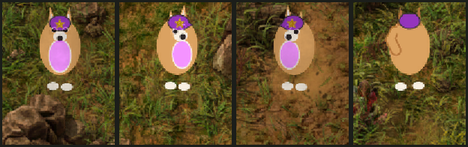

# Commie Doge

A [Factorio](https://factorio.com) mod that reskins the engineer as a comrade Shiba — ☭ for the motherland.



Full 8-direction animated waddle, a curled tail, a player-colored cap with a gold star and hammer & sickle, and a green toy water pistol when armed. The cap fill and chest take your in-game player color; the gold insignia always stays gold.

## Features

- 8-direction animation for idle, running, and mining.
- Directional water-pistol aiming when idle and armed.
- Player-color cap + chest via a runtime-tint mask; fixed-gold star and hammer & sickle layered on top.
- Parametrically generated art — no hand-pixeled sheets.

## Install

**Manual:** copy the `commie-doge/` folder into your Factorio `mods/` directory, enable it, and restart Factorio.

- macOS: `~/Library/Application Support/factorio/mods/`
- Windows: `%APPDATA%\Factorio\mods\`
- Linux: `~/.factorio/mods/`

It's a data-only reskin of the character, so **enable only one character skin at a time** — the mod declares an incompatibility with other known character reskins so the launcher warns you.

## Known limitations

- No custom shadow.
- All armor states (including power armor) render as the same Shiba.
- Shoot-while-moving uses a single non-directional pistol pose: Factorio's 18-direction gun-walk mapping is buggy even in vanilla, so this avoids the "moonwalk" glitch at the cost of directionality in that one state. Directional aiming still works when standing still.

## Regenerating the art

The sprites are generated, not hand-drawn — edit `tools/gen_commie_doge.py`, not the PNGs:

```sh
python3 tools/gen_commie_doge.py contact   # preview contact sheets -> /tmp
python3 tools/gen_commie_doge.py build     # regenerate commie-doge/graphics/
```

Requires Python 3 and ImageMagick (`magick`). Restart Factorio to pick up new sprites (it caches them in a texture atlas at startup).

## License

[MIT](LICENSE).
