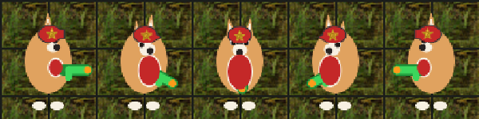

# Commie Doge

A [Factorio](https://factorio.com) mod that reskins the engineer as a comrade Shiba — ☭ for the motherland.


Full 8-direction animated waddle, a curled tail, a player-colored cap with a gold star and hammer & sickle, a green toy water pistol when armed, a gold hammer & sickle swung while mining, and projected cast shadows on every pose. The cap fill and chest take your in-game player color (shown here in red); the gold insignia always stays gold.



Armed, the comrade Shiba pulls out a green toy water pistol and aims it whichever way you face.

## Features

- 8-direction animation for idle, running, and mining — and **directional aim while running and gunning** (an 18-direction sweep matching the vanilla row order), not just when standing still.
- A real gold **hammer & sickle swung as the mining tool**, and a green toy water pistol when armed.
- **Cast shadows** on every pose (`draw_as_shadow`, time-of-day tinted by the engine).
- Player-color cap + chest via a runtime-tint mask; fixed-gold star + hammer & sickle layered on top.
- Optional **doge-speak toasts** — the comrade narrates your factory in broken grammar (*"much science. very five-year-plan. wow."*) on research, rocket launches, combat, low health, mining/building, day↔night and more. Toggle it per player under **Settings → Mod settings → Per player**.
- Parametrically generated art — no hand-pixeled sheets (the hammer & sickle is a public-domain Wikimedia symbol; see `tools/assets/`).

## Install

**Zip (recommended):** download `commie-doge_0.2.0.zip`, drop it — still zipped — into your Factorio `mods/` directory, then launch Factorio and enable **Commie Doge** in the mod list. Factorio loads mods straight from the zip, so don't extract it; restart after enabling.

- macOS: `~/Library/Application Support/factorio/mods/`
- Windows: `%APPDATA%\Factorio\mods\`
- Linux: `~/.factorio/mods/`

**From source:** alternatively, copy the unzipped `commie-doge/` folder into `mods/` instead — Factorio reads mod folders as well as zips.

It reskins the character (a data-stage overwrite, plus a tiny cosmetic runtime script for the toasts), so **enable only one character skin at a time** — the mod declares an incompatibility with other known character reskins so the launcher warns you. Restart Factorio after enabling; it bakes sprites into a texture atlas at startup.

## Known limitations

- All armor states (including power armor) render as the same Shiba.
- Running-and-gunning aims directionally via the 18-direction sweep that matches the vanilla row order; the mirrored half of *its* cast shadow is best-effort (the common poses' shadows are exact).

## Regenerating the art

The sprites are generated, not hand-drawn — edit `tools/gen_commie_doge.py`, not the PNGs:

```sh
python3 tools/gen_commie_doge.py contact   # preview contact sheets -> /tmp
python3 tools/gen_commie_doge.py build     # regenerate commie-doge/graphics/
```

Requires Python 3 and ImageMagick (`magick`). Restart Factorio to pick up new sprites (it caches them in a texture atlas at startup).

## License

[MIT](LICENSE).
